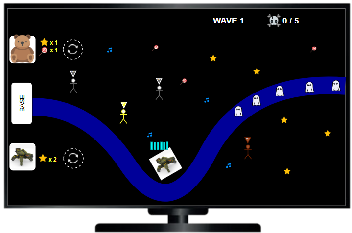

# 🎣 Meow Fishery

## Overview

Bersama-sama memancing di laut dalam dalam petualangan seru! Tangkap berbagai jenis ikan untuk memenuhi kuota, temukan harta karun dan power-up, namun hati-hati dengan bom yang dapat menghalangi misi kalian. Strategi dan ketepatan waktu adalah kunci untuk menjadi pemancing terbaik!&#x20;

## Detail

* Genre: 2D, Fishing, Multiplayer, Co-op
* Jumlah Player: 1 \~ 4 Player

## Target Audience

Game ini dirancang untuk keluarga dengan mekanisme sederhana dan sistem kerja sama yang mendorong interaksi. **Ikan di laut dalam** bisa ditangkap oleh pemain lebih berpengalaman, sementara **ikan di laut dangkal hingga menengah** cocok untuk pemain yang lebih muda. Dengan sistem ini, semua anggota keluarga dapat berperan dan bersenang-senang bersama.

## Core Mechanic

1. :ship: **Pergerakan (Movement):**&#x20;
   * Player dapat menggerakkan perahu ke kiri dan ke kanan
2. :hook: **Melempar Kail (Casting Hook):**
   * Player melempar kail ke laut dengan menentukan sudut dan kekuatan lemparan.
   * Kekuatan lemparan akan menentukan kecepatan turun kail.
   * Kail akan turun secara terus menerus sampai mengenai Objek ataupun tembok
3. :boom: **Ranjau Laut (Sea Mine):**
   * Player harus menghindari bahaya berupa Ranjau Laut.
   * Jika kail pancing Player mengenai Ranjau, maka Ranjau akan meledak dan membunuh ikan disekitarnya
4. :100: **Sistem Poin (Point System)**
   * Sistem Poin bersifat tim (All for one)
   * Player akan menerima Poin dari ikan yang ditangkap.&#x20;
   * Semakin dalam lokasi ikan ditangkap, maka semakin besar poinnya.
   * Player juga akan memperoleh poin besar jika berhasil menangkap peti harta karun.
5. :dart: **Misi / Objektif (Mission)**&#x20;
   * Player diberikan objektif berupa Jenis dan Jumlah ikan yang harus ditangkap.&#x20;
   * Player harus bekerjasama dalam memenuhi objektif untuk memenangkan level.
   * Player tetap bisa menangkap ikan yang tidak sesuai objektif untuk meraih poin tambahan
6.

#### Movement

* Player&#x20;

## Storyboard

<figure><figcaption></figcaption></figure>

