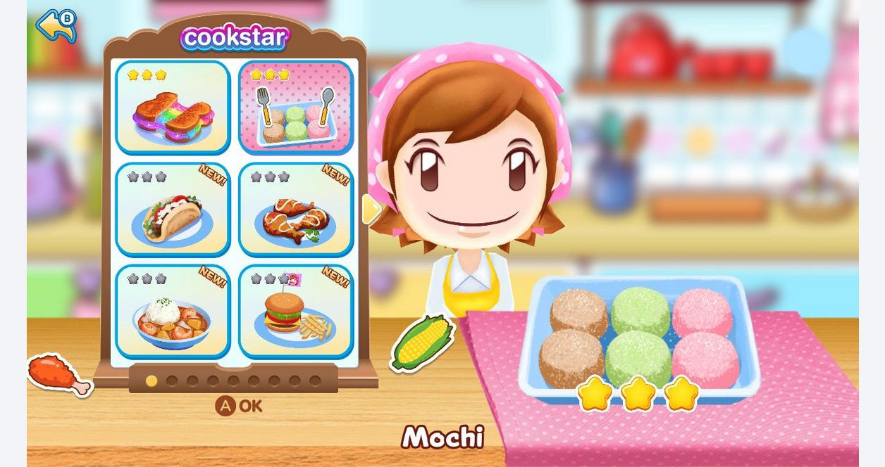

# 🍲 Family Restaurant

## Overview

Ayo jalankan bisnis restoran keluarga ! Bekerja sama dalam menyajikan makanan ke para pelanggan. Setiap pemain harus berkontribusi, mulai dari menerima pesanan, mempersiapkan bahan, memasak, hingga mencuci piring. Dengan tantangan seru dan mekanisme yang sederhana, game ini cocok untuk semua umur, menciptakan pengalaman memasak yang menyenangkan dan mempererat kebersamaan keluarga!

## Detail

* Genre: 2D, Multiplayer, Co-op, Cooking.
* Jumlah Player: 1 \~ 4 Player.
* Art Style: Cartoony, Colourful.
* Design Pillar: Fellowship

## Art Reference

<figure><figcaption>
Cooking Mama: Cookstar
</figcaption></figure>

<figure><figcaption>
Food Cooking: Cooking Games
</figcaption></figure>

## Target Audience

Game ini dirancang untuk Keluarga dengan berbagai variasi gameplay yang seru dan interaktif. Selain bekerja sama dalam menyiapkan pesanan, game ini juga menyisipkan edukasi ringan bagi anak-anak mengenai proses memasak, mulai dari menyiapkan bahan, memasak, hingga menyajikan makanan.

Dengan mekanisme yang sederhana dan menyenangkan, semua anggota keluarga bisa ikut serta, berkomunikasi, dan bersenang-senang bersama!

## Core Mechanic

1. :receipt: Order System
   1. Diawal permainan pelanggan akan datang dan menyampaikan menu yang di inginkan. Pesanan akan dibuat dari kiri ke kanan.
   2. Semua Player harus menekan Ready untuk memulai pembuatan pesanan.
2. :hamburger: One Dish Many Part (Fellowship)
   1. Setiap hidangan terdiri dari beberapa proses penyajian. Setiap proses penyajian akan berupa Minigames yang akan dimainkan Player
3. :handshake: Teamwork (Fellowship)
   1. Setiap Minigames memiliki Progress Bar yang harus dipenuhi dalam batas waktu tertentu.
   2. Progress Bar dapat di isi oleh semua Player sehingga Player harus bekerja sama agar progress bar dapat terisi dengan cepat.
4. :100: Scoring System
   1. Player akan menerima penilaian berdasarkan terpenuhi atau tidaknya Progress Bar.
      1. Jika Player berhasil memenuhi Progress Bar, maka Player akan menerima Score utuh.
      2. Jika Player tidak berhasil memenuhi Progress Bar, maka Player akan menerima 60% Score utuh.&#x20;
5. :timer: Time Management (Challenge)
   1. Player mengasah keterampilan dalam menyelesaikan Minigames sebelum batas waktu yang ditentukan.

## Storyboard

<figure><figcaption></figcaption></figure>

<figure><figcaption></figcaption></figure>

<figure><figcaption></figcaption></figure>
